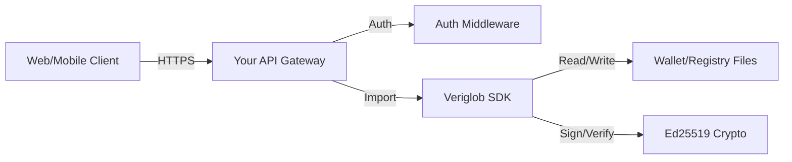

# API Integration Guide

---

> ⚠️ Non-Normative Guidance.
>
> This document describes one possible way to expose Veriglob functionality over a REST API.
> It is not part of the Veriglob protocol specification and is provided for illustrative purposes only.
> Implementers are free to design alternative architectures (embedded SDKs, mobile wallets, gRPC services, etc.).

---

This document outlines how to integrate the Veriglob protocol into a RESTful API service. It is designed for developers building wallets, issuer dashboards, or verification services.

## 🏗 System Architecture

Veriglob is provided as a Go library (`pkg`) and CLI tools. To expose this functionality over HTTP, you should wrap the core logic in a service layer.



### Key Components

1.  **API Layer**: Handles HTTP requests, authentication (API Keys/OAuth), and input validation.
2.  **Veriglob SDK**: The internal Go packages (`internal/vc`, `internal/did`, `internal/revocation`).
3.  **Storage**: Secure storage for issuer private keys (e.g., Hashicorp Vault, AWS KMS) and revocation registries.

---

## 🔄 Integration Flows

### 1. Issuance Flow

This flow describes how an Issuer creates a Verifiable Credential (VC) for a Subject.

1.  **Setup**: Issuer generates a DID (`did:key`) and stores the private key securely.
2.  **Request**: Client requests a credential (e.g., via a KYC process).
3.  **Issue**: API constructs the `CredentialSubject`, signs it using `vc.IssueVC`, and generates a PASETO token.
4.  **Register**: API registers the credential ID in the Revocation Registry.
5.  **Response**: API returns the signed token to the client.

### 2. Verification Flow

This flow describes how a Verifier checks a VC presented by a Holder.

1.  **Presentation**: Holder submits a PASETO token to the API.
2.  **Signature Check**: API calls `vc.VerifyVC` to validate the Ed25519 signature and expiration.
3.  **Revocation Check**: API extracts the Credential ID and checks the Revocation Registry.
4.  **Result**: API returns a boolean validity status and the verified claims.

---

## 📚 API Reference (Proposed Specification)

Below is a recommended REST API specification for a Veriglob-enabled service.

### Base URL

`/api/v1`

### 1. Identity Management

#### Generate DID

Creates a new DID keypair. _Note: In production, private keys should not be returned directly but stored in a secure vault._

- **Endpoint**: `POST /identities`
- **Response**:
  ```json
  {
    "did": "did:key:z6MkhaXgBZDvotDkL5257faiztiGiC2QtKLGpbnnEGta2doK",
    "publicKey": "z6MkhaXg...",
    "privateKey": "..."
  }
  ```

### 2. Credentials

#### Issue Credential

Issues a new Verifiable Credential.

- **Endpoint**: `POST /credentials/issue`
- **Request Body**:
  ```json
  {
    "issuerDid": "did:key:z6MkIssuer...",
    "subjectDid": "did:key:z6MkSubject...",
    "type": "IdentityCredential",
    "claims": {
      "givenName": "Alice",
      "familyName": "Doe",
      "dateOfBirth": "1990-01-01"
    }
  }
  ```
- **Response**:
  ```json
  {
    "token": "v4.public.eyJ...",
    "credentialId": "urn:uuid:3978344f-..."
  }
  ```

#### Verify Credential

Verifies a token's signature and revocation status.

- **Endpoint**: `POST /credentials/verify`
- **Request Body**:
  ```json
  {
    "token": "v4.public.eyJ..."
  }
  ```
- **Response**:
  ```json
  {
    "valid": true,
    "claims": {
      "iss": "did:key:z6MkIssuer...",
      "sub": "did:key:z6MkSubject...",
      "vc": {
        "type": ["VerifiableCredential", "IdentityCredential"],
        "credentialSubject": {
          "givenName": "Alice"
        }
      }
    }
  }
  ```

### 3. Revocation

#### Revoke Credential

Revokes a credential by ID.

- **Endpoint**: `POST /credentials/revoke`
- **Request Body**:
  ```json
  {
    "credentialId": "urn:uuid:3978344f-...",
    "reason": "Employee terminated"
  }
  ```
- **Response**: `200 OK`

---

## 💻 Implementation Guide (Go)

Here is an example of how to map an HTTP handler to the Veriglob SDK functions.

```go
package main

import (
    "encoding/json"
    "net/http"
    "veriglob/internal/vc"
    "veriglob/internal/revocation"
)

func HandleIssueCredential(w http.ResponseWriter, r *http.Request) {
    // 1. Parse Request
    var req struct {
        IssuerDID  string             `json:"issuerDid"`
        SubjectDID string             `json:"subjectDid"`
        Claims     vc.IdentitySubject `json:"claims"`
    }
    if err := json.NewDecoder(r.Body).Decode(&req); err != nil {
        http.Error(w, "Invalid request", 400)
        return
    }

    // 2. Load Issuer Private Key (Securely!)
    // In a real app, fetch this from Vault/KMS based on req.IssuerDID
    privKey := loadPrivateKey(req.IssuerDID)

    // 3. Issue VC
    token, err := vc.IssueVC(req.IssuerDID, req.SubjectDID, privKey, req.Claims)
    if err != nil {
        http.Error(w, "Failed to issue VC: "+err.Error(), 500)
        return
    }

    // 4. Return Token
    json.NewEncoder(w).Encode(map[string]string{
        "token": token,
    })
}
```

## 🔒 Security Considerations

1.  **Private Key Management**: The API acts as a custodian for Issuer keys. Never hardcode keys. Use a KMS or encrypted wallet file.
2.  **HTTPS**: Always serve the API over HTTPS to protect the tokens and keys in transit.
3.  **Authentication**: Protect the Issue and Revoke endpoints. Only authorized issuers should be able to call them.
4.  **Input Validation**: Validate all DIDs and Claim data before processing.
