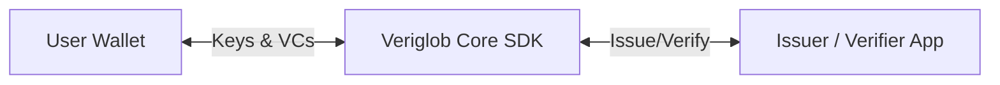
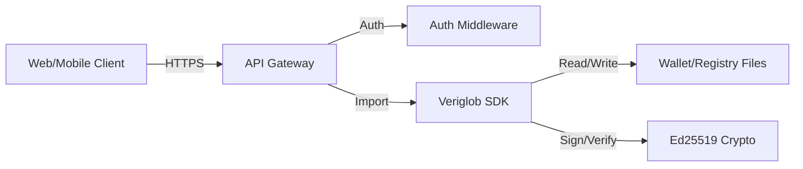

# Architecture Overview

Veriglob is designed as a modular, protocol-first system for decentralized identity. It separates the concerns of key management, credential issuance, and verification to ensure privacy and security.

## High-Level Architecture

The system consists of three main actors:

1.  **User Wallet**: Holds private keys and credentials. Users are sovereign and control their own identity.
2.  **Veriglob Core**: The protocol layer that handles DID creation, cryptographic signing, and credential formatting (PASETO).
3.  **Issuer / Verifier**: Applications that interact with the protocol to issue credentials or verify proofs without taking custody of user secrets.

## System Components

When integrated into an API or service, the architecture expands to include storage and transport layers:

### Component Descriptions

- **Veriglob SDK**: The core Go library (`pkg`) containing logic for `did:key` generation, VC issuance, and revocation checks.
- **Storage**:
  - **Wallets**: Encrypted JSON files storing user keys and credentials locally.
  - **Revocation Registry**: A centralized or distributed store mapping Credential IDs to their status.
- **Crypto Layer**: Pure Ed25519 cryptographic operations.
- **API Layer**: Wraps the SDK to expose functionality to web and mobile clients via REST endpoints.

## Data Flow

1.  **Issuance**: Issuer signs a `CredentialSubject` -> Generates PASETO Token -> Returns to User.
2.  **Presentation**: User selects VCs -> Wraps in `VerifiablePresentation` -> Signs with Holder Key -> Sends to Verifier.
3.  **Verification**: Verifier checks Holder Signature -> Checks Issuer Signature on VCs -> Checks Revocation Status.
